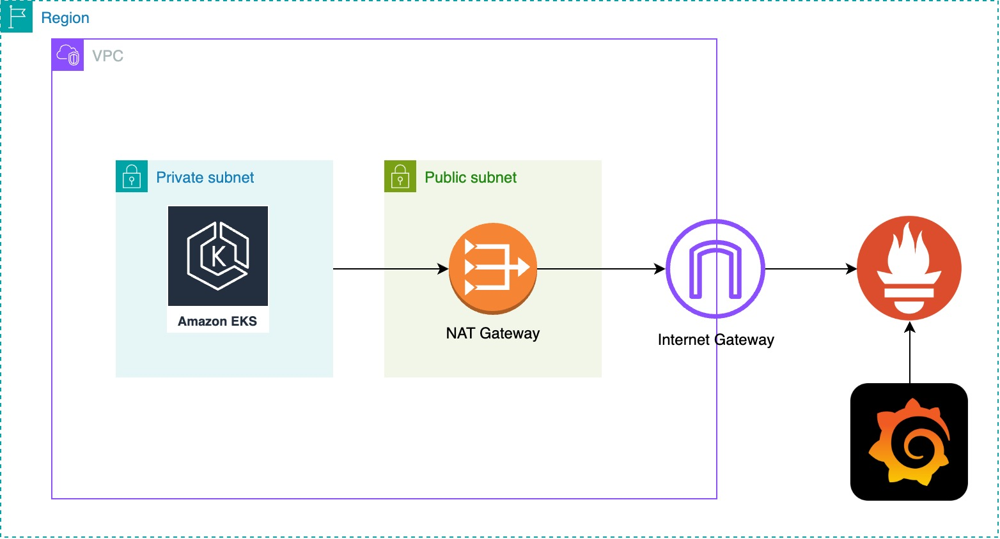

# AMP and AMG Monitoring of Amazon EKS

This repository contains the necessary configurations and code to set up an Amazon EKS, Amazon Managed Prometheus and Amazon Managed Grafana. 

This is a supporting material to my blog post entitled, Serverless EKS Monitoring: Leveraging Amazon Managed Prometheus and Grafana with AWS CDK.
